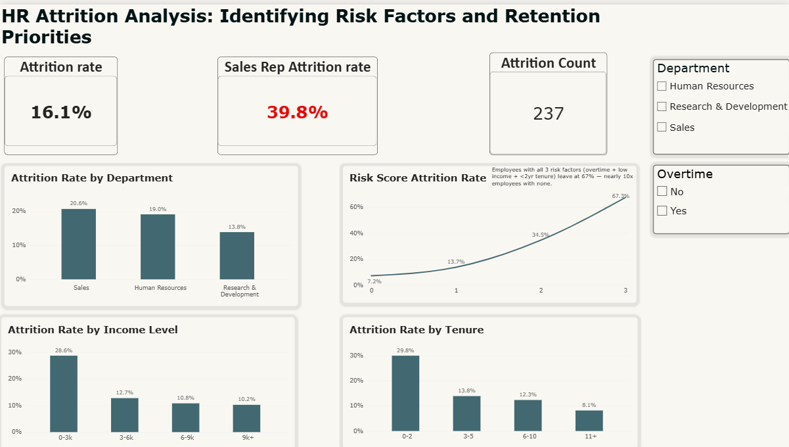

# Employee Attrition Analysis: Key Drivers and Risk Factors

An end-to-end HR analytics project investigating why employees are leaving, using SQL, Python, Excel, and Power BI on the IBM HR Analytics Employee Attrition dataset.


## Key Findings

- **Overall attrition rate is 16.1%**, confirmed consistently across SQL, Python, Excel, and Power BI.
- **Sales Representatives leave at nearly 40%** — 2.5x the company average, and the single highest-attrition job role in the company.
- **Overtime and low income compound each other.** Employees earning under $3k who also work overtime leave at rates as high as 56–70%, depending on role — far higher than either factor alone.
- **Tenure, not age, is the real driver of early attrition.** Employees in their first 0–2 years leave at 30–48%, regardless of age — age only looked significant because younger employees are more likely to be new hires.
- **A simple 3-factor risk score (overtime + low income + under 2 years tenure) cleanly separates risk levels**: employees with all three factors leave at 67%, nearly 10x the rate of employees with none (7%).

## Dashboard



The interactive Power BI report includes:
- KPI cards for overall attrition rate, Sales Rep attrition, and total employees lost
- A department-level view with a filterable slicer
- A risk score chart showing the compounding effect of overtime, low income, and short tenure
- Breakdowns by income level and tenure group

*(Full `.pbix` file available in `/powerbi` — open in Power BI Desktop to explore interactively.)*

## Bottom Line

Attrition isn't evenly spread across the company — it's concentrated in a specific, identifiable group: newer, lower-paid employees working overtime. This points toward a targeted retention strategy (reviewing overtime policy and pay for at-risk roles) rather than a broad, company-wide intervention.

## Tools Used

- **SQL (PostgreSQL)** — data cleaning, flag creation, and all core analysis (`/sql`)
- **Python (pandas, matplotlib)** — validation of SQL results and charting (`/python`)
- **Excel** — PivotTables, risk score formulas, and cross-tool verification (`/excel`)
- **Power BI** — interactive dashboard with KPI cards, filters, and risk visualization (`/powerbi`)

## Dataset

[IBM HR Analytics Employee Attrition & Performance](https://www.kaggle.com/datasets/pavansubhasht/ibm-hr-analytics-attrition-dataset) — Kaggle

## Repo Structure

```
sql/       → cleaning + analysis queries with comments
python/    → notebook validating SQL results with pandas/matplotlib
excel/     → PivotTables, risk score, and cross-checks
powerbi/   → interactive dashboard (.pbix)
```
